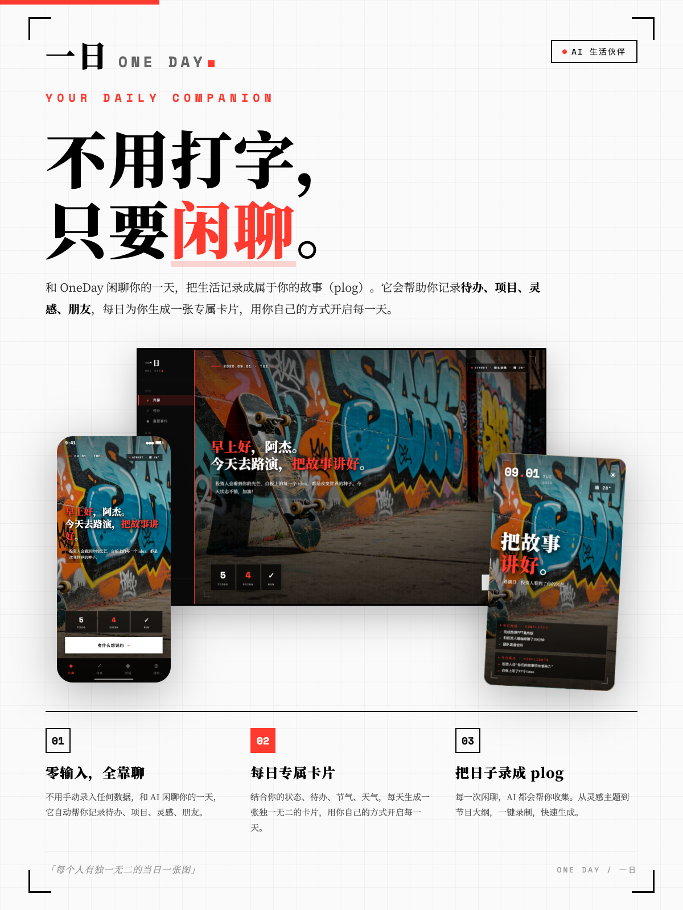
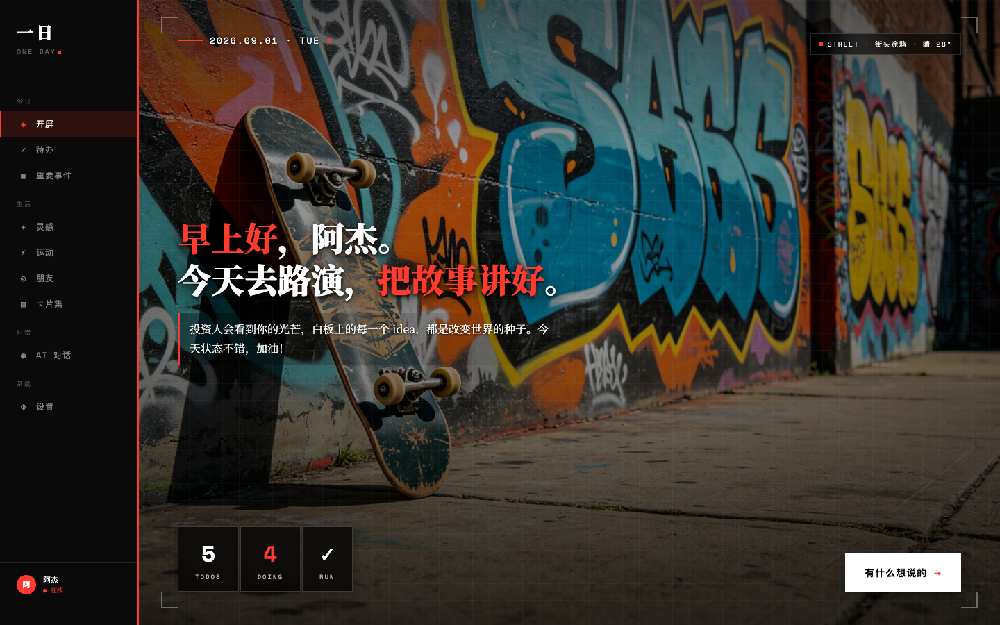
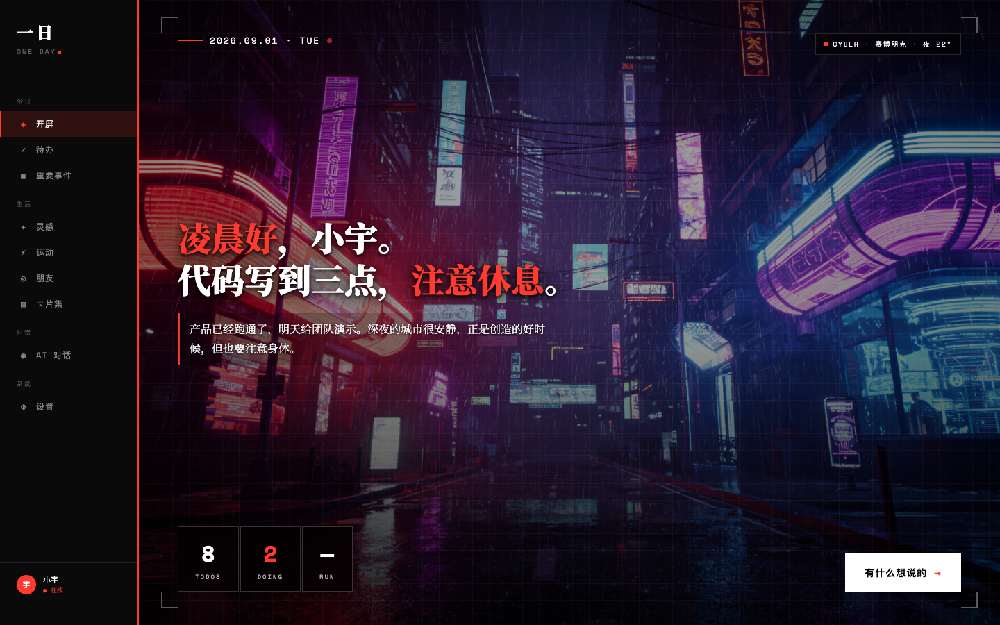
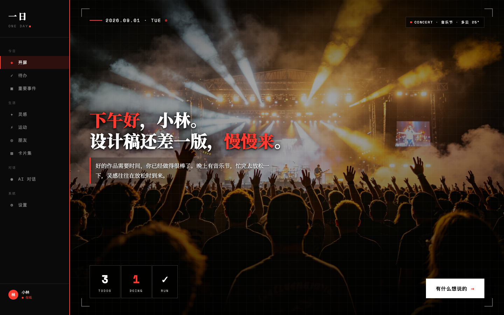
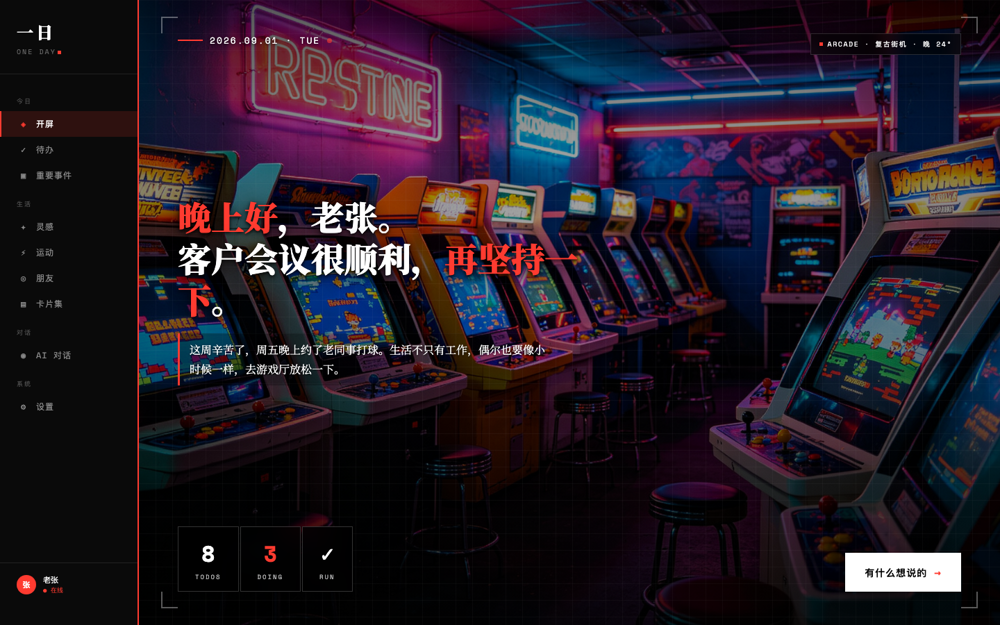
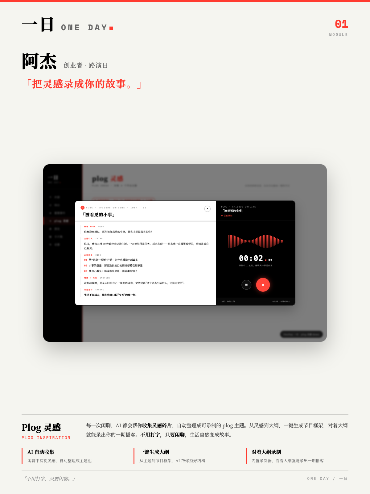
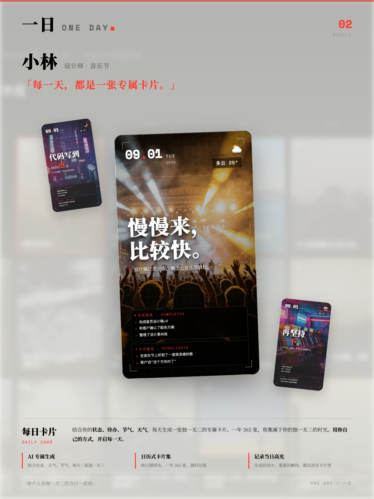
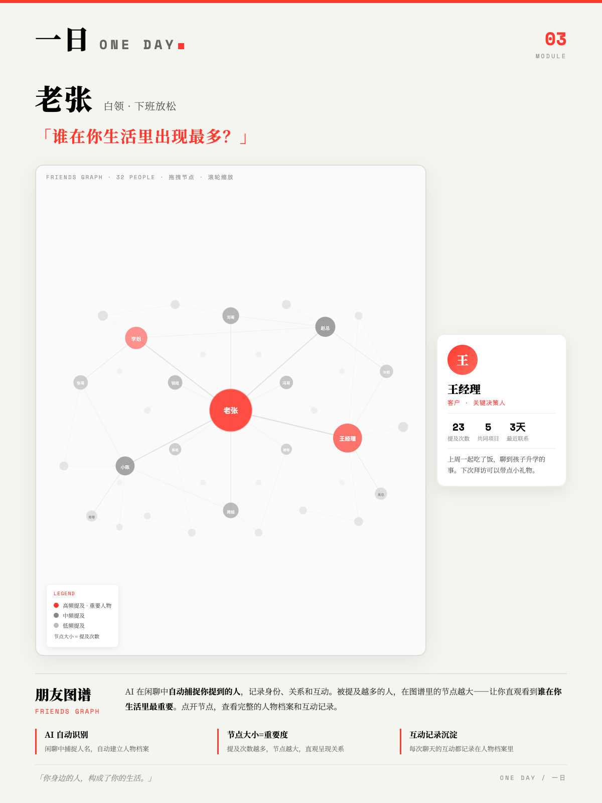

# OneDay / 一日

> 不用打字，只要闲聊。把你的生活记录成故事。
> No typing, just chat. Turn your life into stories.



---

## 🌅 关于 OneDay / About OneDay

**中文：**

OneDay 是一个 AI 驱动的个人生活管理平台。你不需要手动录入任何数据——每天花 5-10 分钟跟 AI 说说话，它会帮你记录待办、项目、灵感、朋友、运动，并且在每个清晨为你生成一张专属于你的卡片，用你自己的方式开启新的一天。

这个产品源于一个简单的习惯：每天睡前跟 AI 复盘当天发生的一切。久而久之发现，你要能表达就要想得透，想得透才能说得出，说得出它才能记得住——而记得住，就衍生出了 OneDay 的一切。

**English:**

OneDay is an AI-powered personal life management platform. You don't need to manually input anything — spend 5-10 minutes chatting with AI every day, and it will help you record todos, projects, inspirations, friends, and exercise. Every morning, it generates a card unique to you, helping you start a new day in your own way.

This product originated from a simple habit: reviewing the day with AI before bed every night. Over time, I realized that to express yourself, you need to think clearly; to think clearly, you need to speak up; when you speak up, it can remember — and from remembering, everything about OneDay was born.

---

## ✨ 核心亮点 / Core Features

### 1. 不用打字，只要闲聊 / No Typing, Just Chat
一切通过和 AI 生活助手对话完成。它会自动帮你整理待办、项目、灵感、运动、朋友，你只需要说。
Everything is done through conversation with your AI life assistant. It automatically organizes your todos, projects, inspirations, exercise, and friends — you just need to talk.

### 2. 每日专属卡片 / Daily Exclusive Card
AI 结合你的状态、待办、节气、天气，每天生成一张独一无二的卡片。一年 365 天，你就有 365 张专属于你的卡片，记录你度过的每一天。
AI combines your state, todos, solar terms, and weather to generate a unique card every day. 365 days a year, you'll have 365 cards unique to you, recording every day you've lived.

### 3. Plog — 把日子录成播客 / Plog — Podcast as a Log
每一次闲聊，AI 都会帮你收集灵感。从灵感主题到节目大纲，一键录制，快速生成一期属于你的播客，把你的生活用语音的方式记录下来。
Every chat, AI helps you collect inspirations. From inspiration topic to show outline, one-click recording, quickly generate your own podcast, recording your life through voice.

### 4. 朋友图谱 / Friends Graph
AI 在闲聊中自动捕捉你提到的人，记录身份、关系和互动。被提及越多的人，在图谱里的节点越大——让你直观看到谁在你生活里最重要。
AI automatically captures people you mention in chats, recording identity, relationships, and interactions. The more someone is mentioned, the larger their node in the graph — letting you visually see who matters most in your life.

---

## 🚀 新手引导 / Getting Started Guide

### 这是什么？/ What is this?

**中文：**

OneDay 是一个 AI 驱动的个人生活管理平台。它的核心理念是**"不用打字，只要闲聊"**——你不需要手动录入任何数据，每天花 5-10 分钟跟 AI 说说话，它会帮你把生活中的一切都整理好。

想象一下：每天晚上睡前，你跟 AI 聊聊天，说说今天发生了什么、心情怎么样、完成了什么、还有什么没做、明天要干嘛。AI 会自动帮你：
- 把待办事项记录下来，并按日期分类
- 把正在跟进的项目整理好
- 把你提到的人记录到朋友图谱
- 把你的灵感收集起来，甚至帮你生成播客大纲
- 记录你的运动状态
- 第二天早上，根据你的状态、待办、天气、节气，生成一张专属于你的卡片，用一句温暖的话开启你的新的一天

**English:**

OneDay is an AI-powered personal life management platform. Its core philosophy is **"No typing, just chat"** — you don't need to manually input anything. Spend 5-10 minutes chatting with AI every day, and it will help you organize everything in your life.

Imagine: every night before bed, you chat with AI, talk about what happened today, how you feel, what you accomplished, what's left undone, what to do tomorrow. AI will automatically help you:
- Record todos and categorize them by date
- Organize projects you're following up on
- Record people you mention into the friends graph
- Collect your inspirations, even help generate podcast outlines
- Track your exercise status
- Every morning, based on your state, todos, weather, and solar terms, generate a card unique to you, opening your new day with a warm message

---

### 能干嘛？/ What can it do?

**中文：**

| 模块 | 功能 | 怎么用 |
|------|------|--------|
| 🎙️ **AI 对话** | 跟 AI 闲聊，自动提取信息 | 点击麦克风按钮，说话，再点击结束 |
| 📋 **待办清单** | 记录待办事项，按日期分类 | AI 自动从对话中提取，也可手动添加 |
| 📁 **重要项目** | 跟进中的项目，记录进度 | AI 自动从对话中提取，也可手动添加 |
| 💡 **Plog 灵感** | 收集灵感，生成播客大纲，一键录制 | AI 自动收集灵感，点击可升级为播客主题 |
| 👥 **朋友图谱** | 记录你提到的人，可视化关系网络 | AI 自动捕捉，可手动编辑身份和关系 |
| 🎴 **每日卡片** | 每天生成专属卡片，记录你的一天 | 早上自动生成，可在卡片集中查看历史 |
| 🏃 **运动打卡** | 记录运动状态，首页提醒打卡 | AI 自动记录，也可手动打卡 |

**English:**

| Module | Feature | How to use |
|--------|---------|------------|
| 🎙️ **AI Chat** | Chat with AI, auto-extract info | Click mic button, speak, click again to end |
| 📋 **Todos** | Record todos, categorize by date | AI auto-extracts from chat, or add manually |
| 📁 **Projects** | Projects in progress, track progress | AI auto-extracts from chat, or add manually |
| 💡 **Plog Inspiration** | Collect inspirations, generate podcast outlines, one-click recording | AI auto-collects, click to upgrade to podcast topic |
| 👥 **Friends Graph** | Record people you mention, visualize relationship network | AI auto-captures, manually edit identity and relationship |
| 🎴 **Daily Card** | Generate unique card every day, record your day | Auto-generated in morning, view history in card collection |
| 🏃 **Exercise** | Track exercise status, homepage reminder | AI auto-records, or check in manually |

---

### 一般怎么操作？/ How to use it?

**中文：**

#### 典型的一天 / A Typical Day

```
🌅 早上 7:30
   ↓
打开 OneDay，看到专属于你的开屏卡片
（AI 根据你的状态、待办、天气、节气生成）
   ↓
卡片上有一句温暖的问候，告诉你今天要做什么
   ↓
📝 白天
   ↓
有灵感了？跟 AI 说一声，它帮你记下来
遇到新朋友了？跟 AI 提一下，它帮你记录到朋友图谱
完成运动了？跟 AI 说一声，它帮你打卡
   ↓
🌙 晚上 21:30
   ↓
花 5-10 分钟跟 AI 聊聊今天
"今天跟客户王总开了个会，项目有进展了"
"明天要做 PPT，后天要写报告"
"今天跑了 5 公里，感觉不错"
"突然想到一个点子，可以做个打卡功能"
   ↓
AI 自动帮你整理好一切：
- 待办：做PPT（明天）、写报告（后天）
- 项目：客户项目（有进展）
- 朋友：王总（客户）
- 灵感：打卡功能
- 运动：跑了5公里
   ↓
😴 睡觉，等待第二天的专属卡片
```

#### 第一次使用 / First Time Use

1. **启动应用**：双击 `启动 OneDay.command`，或在终端运行 `python3 server.py`
2. **打开浏览器**：访问 `http://localhost:8765/`
3. **配置 AI**：进入设置页面，配置你的 AI API Key（推荐 DeepSeek 或豆包）
4. **开始聊天**：点击麦克风按钮，跟 AI 说说话
5. **查看结果**：去各个模块看看 AI 帮你整理了什么

**English:**

#### A Typical Day

```
🌅 7:30 AM
   ↓
Open OneDay, see your unique splash card
(AI generates based on your state, todos, weather, solar terms)
   ↓
Card has a warm greeting, tells you what to do today
   ↓
📝 Daytime
   ↓
Got an inspiration? Tell AI, it helps you record it
Met someone new? Mention to AI, it helps record to friends graph
Finished exercise? Tell AI, it helps you check in
   ↓
🌙 9:30 PM
   ↓
Spend 5-10 minutes chatting with AI about today
"Had a meeting with client Mr. Wang today, project made progress"
"Need to make PPT tomorrow, write report the day after"
"Ran 5km today, feeling good"
"Suddenly thought of an idea, could make a check-in feature"
   ↓
AI automatically organizes everything for you:
- Todos: Make PPT (tomorrow), Write report (day after)
- Project: Client project (making progress)
- Friend: Mr. Wang (client)
- Inspiration: Check-in feature
- Exercise: Ran 5km
   ↓
😴 Sleep, wait for next day's unique card
```

#### First Time Use

1. **Launch app**: Double-click `启动 OneDay.command`, or run `python3 server.py` in terminal
2. **Open browser**: Visit `http://localhost:8765/`
3. **Configure AI**: Go to settings page, configure your AI API Key (recommend DeepSeek or Doubao)
4. **Start chatting**: Click mic button, talk to AI
5. **View results**: Go to each module to see what AI organized for you

---

### 小技巧 / Tips

**中文：**

- 💬 **说得越详细，AI 整理得越好**：跟 AI 聊天时，尽量说清楚时间、人物、事件，AI 能更准确地提取信息
- 📅 **提到日期时用自然语言**："明天"、"后天"、"下周三"、"9月15日"都可以，AI 会自动识别
- 👥 **提到人时说说身份**："客户王总"、"同事小李"，AI 会自动记录身份和关系
- 💡 **灵感随时说**：白天有灵感了随时跟 AI 说，它会帮你收集，晚上还能帮你升级成播客主题
- 🎴 **每天的卡片都是独一无二的**：坚持使用，一年后你会有 365 张专属于你的卡片，记录你度过的每一天
- 🔄 **数据都存在本地**：所有数据都存在你电脑的 `data/` 目录下，不用担心隐私问题

**English:**

- 💬 **The more detailed you speak, the better AI organizes**: When chatting with AI, try to clarify time, people, events, AI can extract info more accurately
- 📅 **Use natural language for dates**: "Tomorrow", "day after", "next Wednesday", "Sept 15" all work, AI auto-recognizes
- 👥 **Mention identity when talking about people**: "Client Mr. Wang", "Colleague Xiao Li", AI auto-records identity and relationship
- 💡 **Speak inspirations anytime**: Got an inspiration during the day? Tell AI anytime, it helps collect, and can even upgrade to podcast topic at night
- 🎴 **Every day's card is unique**: Keep using it, after a year you'll have 365 cards unique to you, recording every day you lived
- 🔄 **All data stored locally**: All data is stored in the `data/` directory on your computer, no privacy concerns

---

## 🖼 界面展示 / Screenshots

### 开屏页 · 千人千面 / Splash Page · Unique for Everyone

| 创业者 · 路演日 | 程序员 · 深夜写代码 |
|:---:|:---:|
|  |  |

| 设计师 · 音乐节 | 白领 · 下班放松 |
|:---:|:---:|
|  |  |

### 核心模块 / Core Modules

| Plog 灵感 | 每日卡片 |
|:---:|:---:|
|  |  |

| 朋友图谱 |
|:---:|
|  |

---

## 📁 目录结构 / Project Structure

```
OneDay 一日/
├── app/                    # 正式版应用 / Production App
│   ├── index.html          # 前端应用 / Frontend
│   ├── server.py           # 后端服务（端口 8765）/ Backend (port 8765)
│   ├── 启动 OneDay.command  # 双击启动脚本 / Double-click launcher
│   ├── assets/             # 静态资源（壁纸等）/ Static assets
│   ├── data/               # 数据文件（JSON）/ Data files
│   ├── images/             # 图片资源 / Images
│   └── backups/            # 历史备份 / Backups
│
├── demo/                   # Demo 演示版 / Demo version
│   ├── index.html          # 主页面 / Main page
│   ├── plog-demo.html      # Plog 功能演示 / Plog demo
│   ├── index-friends.html  # 朋友图谱演示 / Friends graph demo
│   ├── index-cards.html    # 卡片集演示 / Cards collection demo
│   └── assets/             # 演示资源 / Demo assets
│
├── docs/                   # 设计文档 / Design Documents
│   ├── PRODUCT.md          # 产品定位 / Product positioning
│   ├── ARCHITECTURE.md     # 架构设计 / Architecture
│   ├── DESIGN.md           # 设计规范 / Design guidelines
│   ├── DATA_MODEL.md       # 数据模型 / Data model
│   ├── ROADMAP.md          # 路线图 / Roadmap
│   ├── CHANGELOG.md        # 变更日志 / Changelog
│   └── TASK.md             # 任务清单 / Task list
│
└── marketing/              # 宣传物料 / Marketing Materials
    ├── posters/            # 最终海报 / Final posters
    │   ├── 01-主海报/       # Main posters
    │   ├── 02-产品界面/     # Product UI
    │   ├── 03-人物演示/     # Persona demos
    │   └── 04-模块介绍/     # Module intros
    ├── sources/            # 素材源文件 / Source assets
    ├── html/               # 海报 HTML 源文件 / Poster HTML
    └── 历史版本/            # Historical versions
```

---

## 🚀 快速开始 / Getting Started

> ⚠️ **重要：必须先启动后端服务器，才能访问 localhost:8765**
> 不要直接双击 `index.html` 打开（file:// 协议下 API 调用会全部失败）。
>
> ⚠️ **Important: You must start the backend server first before accessing localhost:8765**
> Do NOT directly double-click `index.html` (API calls will fail under file:// protocol).

### 环境要求 / Requirements
- Python 3.7+（macOS 自带 / macOS comes with Python pre-installed）
- 现代浏览器（Chrome / Safari / Edge）

### 启动正式版 / Run Production App

**方式一：命令行 / Command Line**
```bash
cd app
python3 server.py
```

**方式二：macOS 双击启动 / macOS Double-click**
```
直接双击 app/启动 OneDay.command
```

启动成功后会显示：
```
OneDay / 一日 后端已启动
端口: 8765
访问: http://localhost:8765
```

然后在浏览器打开 / Then open in browser: **http://localhost:8765**

### 查看 Demo / View Demo
Demo 是纯静态页面，可以直接用浏览器打开 `demo/index.html` 体验。
Demo is a static page — simply open `demo/index.html` in your browser.

### 常见问题 / FAQ

**Q: 打开 localhost:8765 显示"无法访问此网站"怎么办？**
A: 说明后端服务器没有启动。请先在终端运行 `cd app && python3 server.py`，看到启动成功提示后再访问。

**Q: 提示 "python3: command not found" 怎么办？**
A: 说明电脑没装 Python。macOS 用户运行 `xcode-select --install` 安装，或从 https://www.python.org/downloads/ 下载安装。

**Q: 提示 "Address already in use" 怎么办？**
A: 8765 端口被占用了。可以修改 `app/server.py` 里的 `PORT = 8765` 为其他端口，或关闭占用端口的程序。

**Q: 直接双击 index.html 能打开但功能不正常？**
A: 正常现象。直接打开用的是 file:// 协议，AI 对话、定时任务、数据保存等功能都需要后端服务器支持。请用上面的方式启动服务器后访问。

**Q: 浏览器显示 "无法访问此网站" 或 "连接不安全"？**
A: 请检查地址栏是不是 `https://`（带 s）。我们的本地服务器是 HTTP 协议，必须用 `http://localhost:8765/`（不带 s）访问。有些浏览器会自动把 http 升级成 https，导致访问失败，手动改成 http 即可。

**Q: 怎么从零开始使用，不要预设的演示数据？**
A: 项目自带了演示数据（`app/data/` 目录），方便你快速体验。如果想从零开始：
1. 关闭服务器
2. 把 `app/data/` 目录重命名为 `app/data-demo/`（备份演示数据）
3. 把 `app/data-empty/` 目录重命名为 `app/data/`
4. 重新启动服务器，就是全新的空数据版本了

或者直接删除 `app/data/` 目录下的所有 `.json` 文件（保留 `settings.json`），重启服务器也会自动创建空数据。

---

## 🎨 设计风格 / Design Style

OneDay 采用 **Nothing × One** 混搭风格：
- **黑白红三原色** — 简洁、年轻、有态度
- **中文 Noto Serif SC 衬线体** — 温暖、有质感
- **英文 Space Mono 等宽体** — 电子感、个性
- **每日专属开屏图** — 年轻、大胆、千人千面

OneDay uses a **Nothing × One** mixed style:
- **Black, white, and red** — clean, young, with attitude
- **Noto Serif SC for Chinese** — warm, textured
- **Space Mono for English** — electronic,个性
- **Daily exclusive splash images** — young, bold, unique for everyone

---

## 🛠 技术栈 / Tech Stack

- **前端 / Frontend**: 原生 HTML + CSS + JavaScript（单页应用）
- **后端 / Backend**: Python Flask（轻量本地服务）
- **数据存储 / Data**: JSON 文件（本地存储，无需数据库）
- **AI 能力 / AI**: 支持接入 DeepSeek / 豆包等大模型 API

---

## 🗺 路线图 / Roadmap

- [x] 核心框架搭建 / Core framework
- [x] 开屏页 + 每日卡片 / Splash + Daily cards
- [x] 待办 + 重要事件 / Todos + Projects
- [x] Plog 灵感 + 录制 / Plog inspiration + recording
- [x] 朋友图谱 / Friends graph
- [x] AI 对话界面 / AI chat interface
- [x] 深色模式 / Dark mode
- [ ] AI 大模型真实接入 / Real AI model integration
- [ ] AI 生成个性化每日壁纸 / AI-generated daily wallpaper
- [ ] AI 生成专属每日寄语 / AI-generated daily message
- [ ] 系统日历对接 / System calendar integration
- [ ] 语音输入 / Voice input
- [ ] 移动端适配 / Mobile adaptation

---

## 📄 开源协议 / License

MIT License — 详见 [LICENSE](LICENSE) 文件。
MIT License — see [LICENSE](LICENSE) for details.

---

## 💌 联系 / Contact

如果你喜欢 OneDay，欢迎 Star 和贡献代码！
If you like OneDay, feel free to Star and contribute!

---

*OneDay / 一日 — 陪伴你过好每一天。*
*OneDay — accompanying you through every day.*
